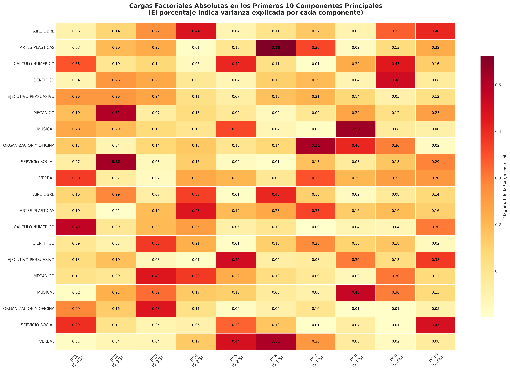

# Sistema de Recomendación Vocacional utilizando PCA y Clustering


Sistema avanzado de recomendación vocacional que combina Análisis de Componentes Principales (PCA) y técnicas de clustering para identificar perfiles estudiantiles y sugerir carreras universitarias adecuadas.

## 📊 Contexto del Proyecto

En el ámbito de la orientación vocacional, la identificación precisa de perfiles estudiantiles representa un desafío fundamental. Este proyecto analiza **10,000 registros** de cuestionarios vocacionales, combinando técnicas avanzadas de ciencia de datos para descubrir patrones ocultos en las preferencias y aptitudes de los estudiantes.

## 🧠 Metodología

El sistema emplea un enfoque de dos fases:

1. **Análisis de Componentes Principales (PCA)**:
   - Reduce 20 variables originales (10 intereses + 10 aptitudes) a 10 dimensiones clave
   - Explica el 66% de la varianza total
   - Elimina redundancias en los datos

2. **Clusterización (K-Means)**:
   - Agrupa estudiantes en 5 perfiles vocacionales distintos
   - Utiliza componentes PCA como input para mayor robustez

## 🛠️ Tecnologías Utilizadas

```python
python==3.12.10
pandas>=2.1.1
numpy>=1.26.0
matplotlib>=3.8.3
seaborn>=0.13.2
scipy>=1.13.1
scikit-learn>=1.5.2
joblib>=1.3.2
```


## Ejemplo de Resultados
### Caso Estudiante ID 500
```markdown
=== RESULTADOS ===
**Estudiante:** Sessa Carrillo  
**Cluster asignado:** 3  

**Componentes principales relevantes:**  
- PC3: Organizativo-Técnico (Score: -2.02)  
- PC4: Aire Libre vs Artístico (Score: -1.13)  
- PC2: Social vs Técnico-Práctico (Score: 0.79)  

**Carreras recomendadas:**  
1. Investigación Científica  
2. Derecho (especialidades técnicas)  
3. Lingüística Computacional  
4. Periodismo Científico  
5. Filosofía de la Ciencia  

**Variables destacadas:**  
*Intereses:*  
- SERVICIO SOCIAL: 86.67  
- ARTES PLASTICAS: 73.33  
- MUSICAL: 70.00  

*Aptitudes:*  
- CALCULO NUMERICO: 66.67  
- VERBAL: 66.67  
- ARTES PLASTICAS: 63.33  
```

## **Aplicaciones prácticas**

- Identificación de perfiles estudiantiles
- Herramienta para orientadores vocacionales
- Autoconocimiento para estudiantes

## 📊 Visualizaciones Clave

### 1. Cargas Factoriales Absolutas en los Primeros 10 Componentes Principales, El porcentaje indica varianza explicada por cada componente

*Figura 1: Porcentaje de varianza explicada por cada componente principal*

### 2. Distribución de Clusters

*Figura 2: Proporción de estudiantes en cada cluster vocacional*

### 3. Mapa de Calor de Variables

*Figura 3: Correlación entre variables y componentes principales*


